# Architecture & flow

<p align="center">
  <a href="assets/pipeline.mmd" title="View pipeline source (Mermaid)">
    
  </a>
</p>

<sub align="center">

Source: [assets/pipeline.mmd](assets/pipeline.mmd) · Regeneration command in [assets/README.md](assets/README.md).

</sub>

Derived from the real import graph. Everything funnels up into one hub —
`detector.py`. Enums are the shared leaf, which is why no server/tool name is
hardcoded anywhere.

The blueprint above is the runtime pipeline (`DWG CYC-001`): an MCP agent's calls
are tapped out-of-band, taint-classified (C1), linked into a provenance graph (C3),
and matched against the two typed flow rules (C2) — `EXFILTRATION`
(untrusted ⇝ sensitive ⇝ egress, **OWASP LLM02**) and `EXCESSIVE_AGENCY`
(untrusted ⇝ privileged, **OWASP LLM06**) — before the sink fires.

## Module dependency graph

<p align="center">
  <a href="assets/module-graph.mmd" title="View module-graph source (Mermaid)">
    
  </a>
</p>

<sub align="center">

Source: [assets/module-graph.mmd](assets/module-graph.mmd) · Regeneration command in [assets/README.md](assets/README.md).

</sub>

## File by file

| File | Role | Depends on |
|------|------|-----------|
| `enums/` | `Server`, `Tool`, `Taint`, `Mode` — the only place names live | — |
| `patterns.toml` | untrusted/sensitive servers, secret markers, egress pairs, token regex | — |
| `config.py` | loads `patterns.toml` into typed, enum-keyed constants | enums |
| `overlap.py` | tokenizes text and matches across **decoded** forms (base64) — the encoding-unmask | config |
| `records/tool_call.py` | `ToolCall` dataclass (+ `is_egress`) | config, enums |
| `records/metrics.py` | `Metrics` dataclass — calls / flagged / blocked / taint | enums |
| `classify.py` | assigns `Taint` to a call from server + path + content | config, enums |
| `severity.py` | distinctive secret-token bytes reaching the sink (aggregated per sink) | overlap |
| `graph.py` | provenance DiGraph; `find_toxic_path()` = untrusted→sensitive→egress | overlap, records, enums |
| `detector.py` | **hub** — `feed` / `toxic_path` / `leak_bytes` / `blocks`, holds graph + metrics | classify, graph, severity, records |
| `downstream.py` | typed loader for `downstream.toml` — binds real MCP servers to logical roles | enums |
| `proxy.py` | external MCP proxy: connects the declared servers, taps calls, detect or prevent, writes `session.json` | detector, config, downstream |

## Runtime flow — live (`cyclops` / `python -m cyclops.proxy`)

```
downstream.py → reads downstream.toml (CYCLOPS_DOWNSTREAM)
             → proxy connects each declared server (stdio or Streamable HTTP)
MCP agent → proxy.py (MCP) → real downstream tool servers
                 │ taps every call → detector (the hub)
                 │      → classify()      taint: web=untrusted, key-read=sensitive
                 │      → graph.add_call() overlap decides derives-from edges (base64-aware)
                 └ detect: flag  |  prevent: deny the egress/privileged sink before it fires
             → out/session.json (per-class flows + OWASP tag + leaked bytes + metrics)
```

## Detection in four steps

1. **Tag** each tool result: untrusted (web) / sensitive (secret read) / normal.
2. **Link** calls with a provenance edge when a later call's arguments share a
   distinctive token with an earlier result — checked across base64-decoded forms.
3. **Search** for a path untrusted → sensitive → egress.
4. **Score** the bytes of the secret that reached the sink; in prevent mode, deny.
